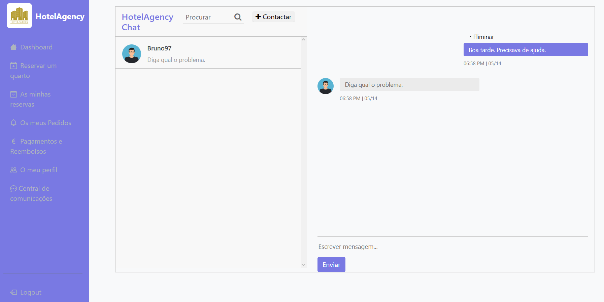
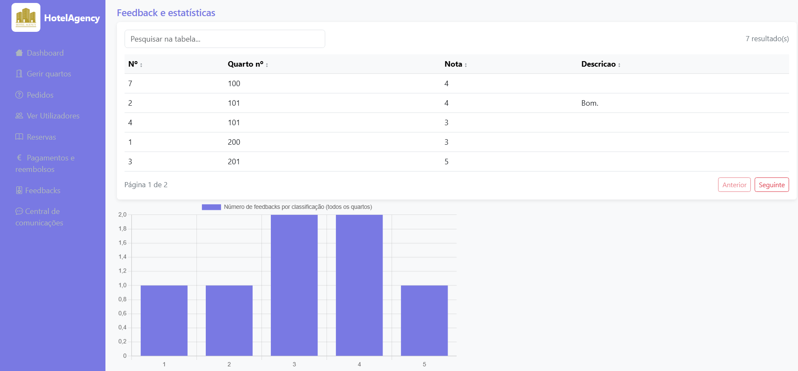

# HotelAgency

O projeto consiste num sistema de reserva de quartos de uma unidade hoteleira. O diferencial deste projeto para outros é que não se limita apenas ao CRUD(Create,Read,Update and Delete)
,mas a integrar o maior número de funcionalidades, segue a seguinte lista:
- Emissão de faturas;
- Sistema de feedback com classificações (escala 1 a 5), por quarto;
- Gráficos estatísticos;
- Sistema de pedidos, comunicação entre administrador e cliente.

Já no que toca à parte da autenticação: como a segurança é um tema muito importante, temos encriptação de password, bloqueio de conta durante x minutos após 3 
tentativas de login e logout por inatividade.

